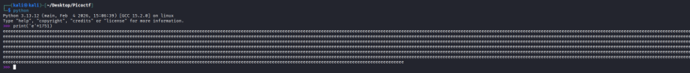
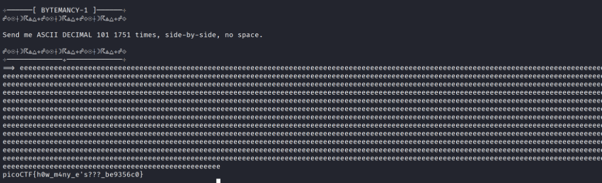

# 🧙‍♂️ Bytemancy-1 (picoCTF)
- **Category:** General Skills
- **Points:** 100
- **Difficulty:** Easy
- **Format:** Python Script / Interactive CLI

---

## 📖 Challenge Overview
The **Bytemancy-1** challenge asks the user to input the ASCII Decimal character `101` exactly `1751` times, side-by-side with no spaces. If the user enters the correct string, the server prints the flag.

---

## 🧠 My Learning Journey & Discovery

### Phase 1: Code Review 🔍
```python
user_input = input('==> ')
if user_input == "\x65"*1751:
  print(open("./flag.txt", "r").read())
```

* **Observation 1:** `\x65` is the hexadecimal representation of the ASCII character.
  - Hex `65` converts to decimal `101` ($6 \times 16 + 5 = 101$).
  - In the ASCII character set, decimal `101` corresponds to the lowercase letter `'e'`.
* **Observation 2:** The python expression `"\x65"*1751` repeats the character `'e'` exactly 1751 times.
* **Observation 3:** The script uses Python 3's `input()` function, which captures input strictly as a literal string. If we type `"e"*1751` or `e*1751` directly into the prompt, the script compares the literal string `'"e"*1751'` to 1751 `'e'`s, which fails.

### Phase 2: Generating and Submitting the Payload (Beginner Method) 🐣

Instead of manually typing 1,751 `'e'`s, we can generate them using Python and copy-paste them:

1. **Generate the Payload**: Launch the Python interactive interpreter in the terminal by typing `python` (or `python3`), and run:
   ```python
   print('e' * 1751)
   ```
   This will print the lowercase letter `'e'` exactly 1,751 times. Copy the entire generated string.

   

2. **Submit to the Server**: Connect to the challenge server using netcat (`nc foggy-cliff.picoctf.net 61920`). Paste the copied sequence into the prompt and hit **Enter** to receive the flag.

   

---

### Phase 3: Alternative (Automated) Method 🚀
For a more advanced/automated approach, we can redirect standard streams by piping the Python output directly into `nc` in a single command:
```bash
python3 -c "print('e' * 1751)" | nc foggy-cliff.picoctf.net 61920
```

---

## 🚩 Flag

```text
picoCTF{h0w_m4ny_e's???_be9356c0}
```

---

## 🎓 Key Takeaways & Remediation
- **Interactive Python Shell**: Quick way to perform operations, calculations, or generate payload strings.
- **Python 3 `input()` behavior**: Python's `input()` function reads the input raw as a string and does not evaluate it.
- **Hex/Decimal Conversion**: ASCII representations can be referenced in hexadecimal (`\x65`) or decimal (`101`).
- **Standard Streams**: Piping (`|`) allows passing the standard output (stdout) of one process directly as the standard input (stdin) of another.
