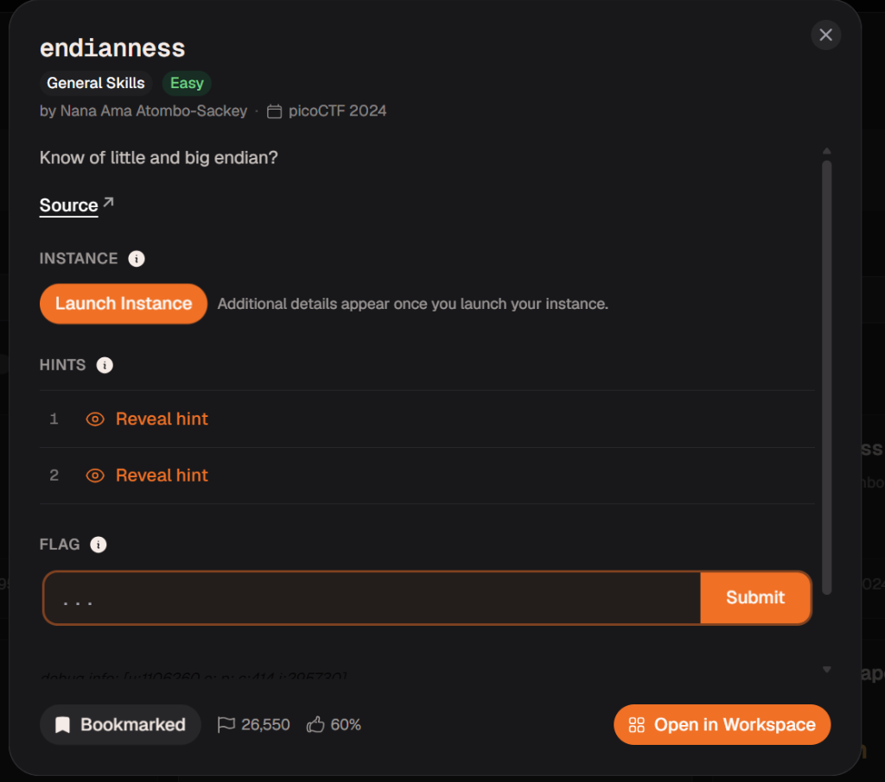
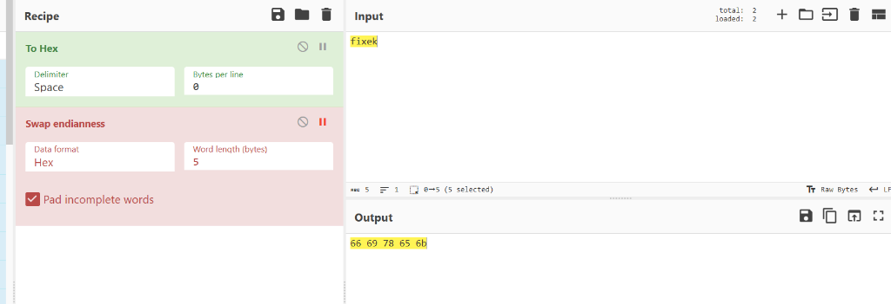
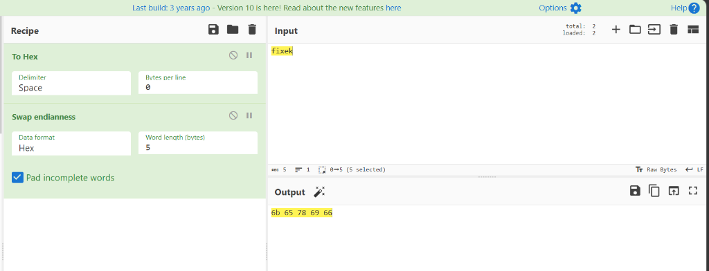

# Writeup: endianness

- **Platform**: picoCTF 2024
- **Category**: General Skills
- **Difficulty**: Easy
- **Author**: Nana Ama Atombo-Sackey

---

## 🎯 Challenge Description

> Know of little and big endian?



---

## 🧰 Tools & Technologies Used

- **CyberChef**: Data encoding (`To Hex`) & byte swapping (`Swap endianness`)
- **C Source Code Analysis**: [flag.c](./flag.c)

---

## 🔍 Initial Triage & Source Code Analysis

We were provided with the source code [`flag.c`](./flag.c), which shows how the server validates the input:

1. **Little Endian Function** (`find_little_endian`):
   ```c
   for (size_t i = word_len; i-- > 0;)
   {
       snprintf(&little_endian[(word_len - 1 - i) * 2], 3, "%02X", (unsigned char)word[i]);
   }
   ```
   Iterates over the target string backwards (from right to left) and converts each character to uppercase 2-digit Hex.

2. **Big Endian Function** (`find_big_endian`):
   ```c
   for (size_t i = 0; i < length; i++)
   {
       snprintf(&big_endian[i * 2], 3, "%02X", (unsigned char)word[i]);
   }
   ```
   Iterates over the target string normally (from left to right) and converts each character to uppercase 2-digit Hex.

---

## 🚀 Step-by-Step Solution

Given word from the server: **`fixek`**

### Step 1: Big Endian Representation (Natural Order)

Convert ASCII characters left-to-right to Hex:
- `'f'` = `66`
- `'i'` = `69`
- `'x'` = `78`
- `'e'` = `65`
- `'k'` = `6b`

**Big Endian Hex**: `666978656b`



---

### Step 2: Little Endian Representation (Reversed Order)

Reverse the 5-byte character sequence (`'k'`, `'e'`, `'x'`, `'i'`, `'f'`) and convert to Hex:
- `'k'` = `6b`
- `'e'` = `65`
- `'x'` = `78`
- `'i'` = `69`
- `'f'` = `66`

**Little Endian Hex**: `6b65786966`



---

### Step 3: Submitting Values & Obtaining Flag

```text
Welcome to the Endian CTF!
You need to find both the little endian and big endian representations of a word.
If you get both correct, you will receive the flag.
Word: fixek
Enter the Little Endian representation: 6b65786966
Correct Little Endian representation!
Enter the Big Endian representation: 666978656b
Correct Big Endian representation!
Congratulations! You found both endian representations correctly!
Your Flag is: picoCTF{3ndi4n_sw4p_su33ess_02999450}
```

---

## 🚩 Flag

```text
picoCTF{3ndi4n_sw4p_su33ess_02999450}
```

---

## 🎓 Key Takeaways

- **Big Endian**: Stores the Most Significant Byte (MSB) first (sequential ASCII hex order).
- **Little Endian**: Stores the Least Significant Byte (LSB) first (reversed byte order).
