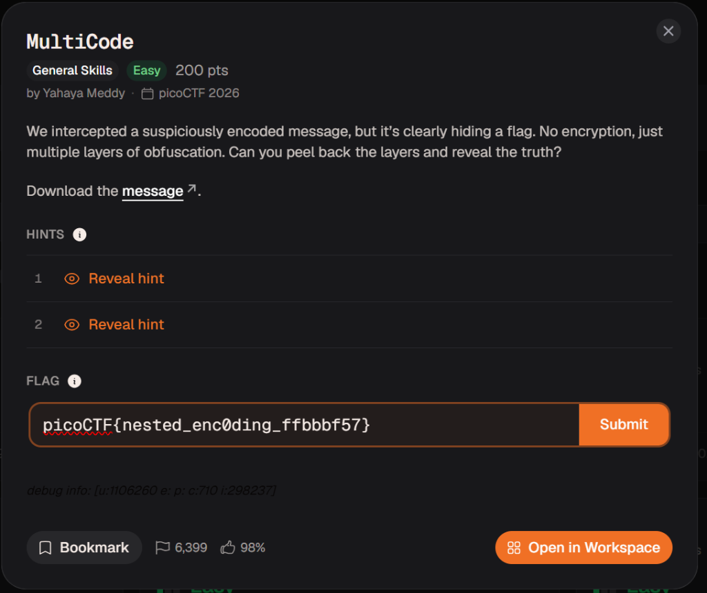
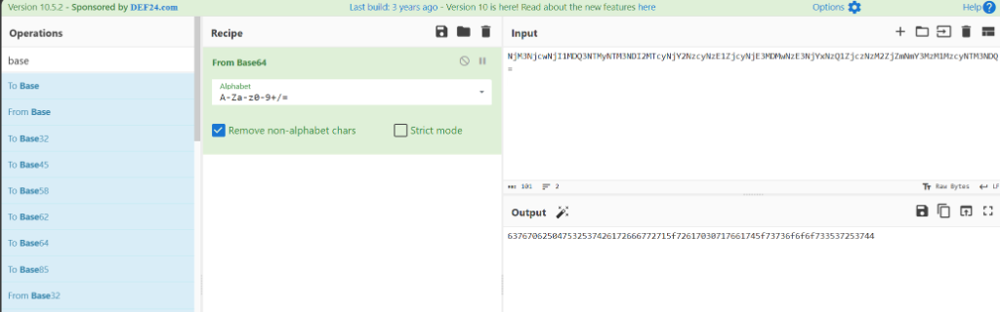
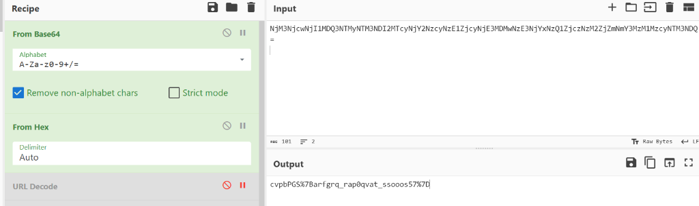
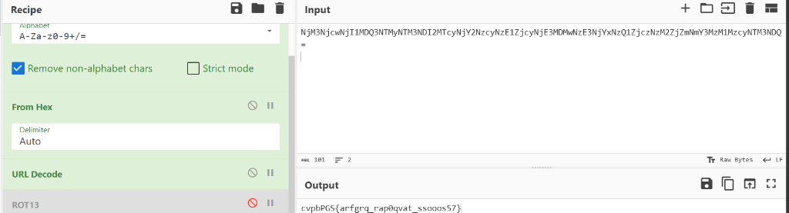
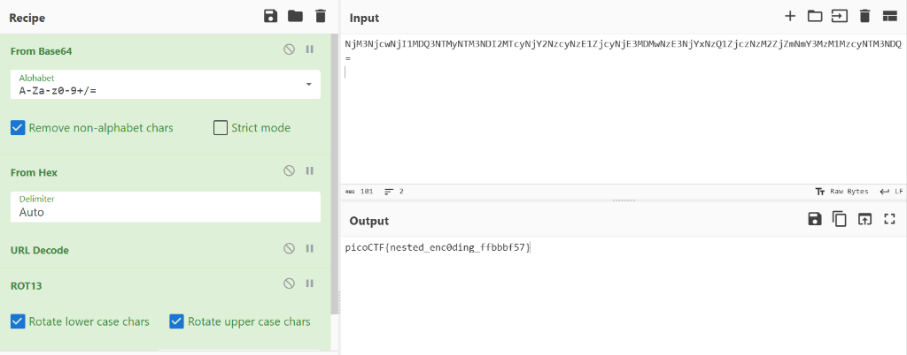

# 🧩 MultiCode (picoCTF)
- **Category:** General Skills
- **Points:** 200
- **Difficulty:** Easy
- **Format:** Multi-Layered Obfuscation / Decoding

---

## 📖 Challenge Overview
The **MultiCode** challenge presents us with a nested, multi-layered encoded message. Our task is to reverse each layer of obfuscation step-by-step to reveal the flag. 



---

## 🧠 My Learning Journey & Discovery

### Phase 1: CyberChef Analysis 🧪
When inspecting the contents of `message.txt`:
`NjM3NjcwNjI1MDQ3NTMyNTM3NDI2MTcyNjY2NzcyNzE1ZjcyNjE3MDMwNzE3NjYxNzQ1ZjczNzM2ZjZmNmY3MzM1MzcyNTM3NDQ=`

* **Observation 1 (Base64):** The string ends with `=` which is a classic indicator of Base64 padding.
* **Action:** I loaded the string into **CyberChef** and added the **From Base64** operation.
* **Result:** The decoded text was a long string of numbers and letters that looked exactly like a hexadecimal string:
  `637670625047532537426172666772715f72617030717661745f73736f6f6f733537253744`



* **Observation 2 (Hex & URL Encode):** This output is a hexadecimal representation. I added the **From Hex** operation to the CyberChef recipe.
* **Result:** The hex string decoded to:
  `cvpbPGS%7Barfgrq_rap0qvat_ssooos57%7D`
  
  Notice the `%7B` and `%7D` within the decoded string. These are URL-encoded representations of the curly braces `{` and `}` respectively.



* **Action:** I added **URL Decode** to the CyberChef recipe.
* **Result:** The output transformed into:
  `cvpbPGS{arfgrq_rap0qvat_ssooos57}`



* **Observation 3 (ROT13):** The output `cvpbPGS{...}` has the structure of a standard picoCTF flag (`picoCTF{...}`). 
  By comparing the letters:
  - `c` -> `p` (shift of 13)
  - `v` -> `i` (shift of 13)
  - `p` -> `c` (shift of 13)
  - `b` -> `o` (shift of 13)
  - `P` -> `C` (shift of 13)
  - `G` -> `T` (shift of 13)
  - `S` -> `F` (shift of 13)
  
  This is a standard **ROT13** cipher.
* **Action:** I added the **ROT13** operation to the recipe.
* **Result:** The flag was successfully revealed: `picoCTF{nested_enc0ding_ffbbbf57}`



---

## 🛠️ Step-by-Step Resolution Pipeline

| Step | Operation | Input / Output Snippet | Explanation |
|:---:|:---|:---|:---|
| **1** | **From Base64** | `NjM3N...=` &rarr; `63767062...` | Decodes the initial Base64 payload, revealing a Hex-encoded string. |
| **2** | **From Hex** | `63767062...` &rarr; `cvpbPGS%7B...%7D` | Converts Hex representation to raw ASCII text. |
| **3** | **URL Decode** | `cvpbPGS%7B...%7D` &rarr; `cvpbPGS{...}` | Decodes `%7B` to `{` and `%7D` to `}`. |
| **4** | **ROT13** | `cvpbPGS{...}` &rarr; `picoCTF{nested_enc0ding_ffbbbf57}` | Shifts alphabetic characters by 13 to reveal the plaintext flag. |

---

## 🚩 Flag

```text
picoCTF{nested_enc0ding_ffbbbf57}
```
