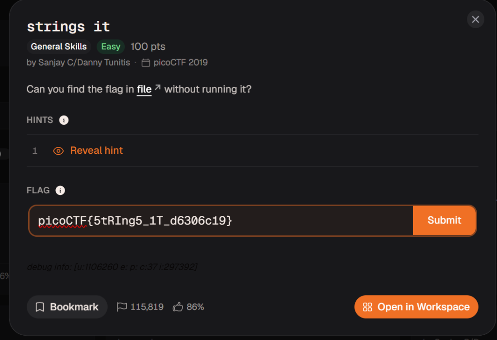

# 🧵 strings it (picoCTF)
- **Category:** General Skills
- **Points:** 100
- **Difficulty:** Easy
- **Format:** CLI Tool Usage / Binary Extraction

---

## 📖 Challenge Overview
Can you find the flag in file without running it?



---

## 💻 Command Flow

```bash
┌──(kali㉿kali)-[~/pico-ctf-notes/01-General-Skills/Strings-it]
└─$ cat strings         
ELF>@h
@@@@▒▒▒pp55   -==t))-==888 XXXDDStd888 PtdH H H DDQtdRtd-==PP/lib64/ld-linux-x86-64.so.2GNUGNU+rPGN<AEJu_GNUem)L 
                                                                                                                                                &.[ w "▒(libc.so.6putsstdout__cxa_finalizesetvbuf__libc_start_mainGLIBC_2.2.5__gmon_start___ITM_deregisterTMCloneTable_ITH=2/H=qVHjVH9tH/Ht   H=AVH5:VH)HH?HHHtH.HfD=Vu+UH=.Ht%/D%]/D%U/D1I^HHPTLH
                                                                                                H=.  dU]wUHH}HuHUHH=gAWL=+AVIAUIATAUH-+SL)HHt1LLDAHH9uH[]A\A]A^A_ff.HHMaybe try the 'strings' function? Take a look at the man pageD▒8`!h8zRx
                                                                                               /D$4X0F▒J
{                                                                                                              ?▒:*3$"\`tX IDEC
DpeFI▒E E(D0H8G@n8A0A(B B▒B`    


                                                                                  
┌──(kali㉿kali)-[~/pico-ctf-notes/01-General-Skills/Strings-it]
└─$ strings strings | grep 'flag*'
Vvhflanudv07ELhPMrB5l56aAjsjEnHvqtLBn1PsFX4jL
5fla6pUby12WBZiRpiQUAuLQdof23
                                                                                                                                                                                 
┌──(kali㉿kali)-[~/pico-ctf-notes/01-General-Skills/Strings-it]
└─$ strings strings | grep 'flag' 
                                                                                                                                                                                 
┌──(kali㉿kali)-[~/pico-ctf-notes/01-General-Skills/Strings-it]
└─$ strings strings | grep 'pico'
picoCTF{5tRIng5_1T_d6306c19}
```

---

## 🚩 Flag

```text
picoCTF{5tRIng5_1T_d6306c19}
```
