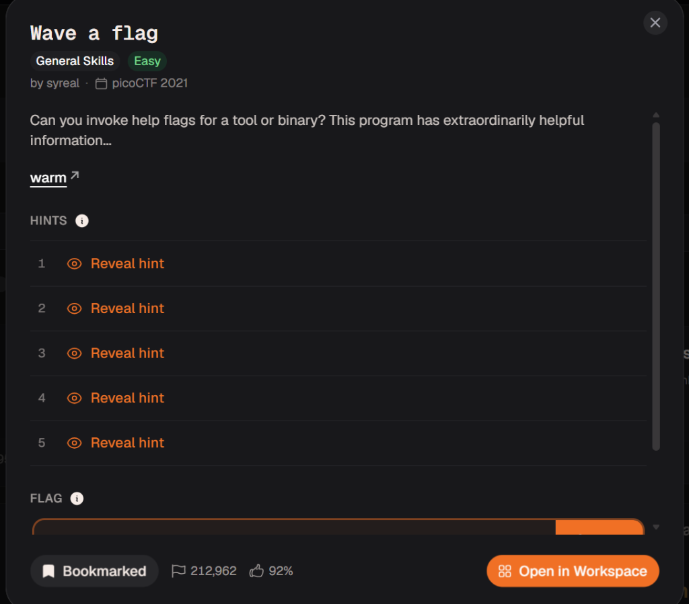

# Writeup: Wave a flag

- **Platform**: picoCTF 2021
- **Category**: General Skills
- **Difficulty**: Easy
- **Author**: syreal

---

## 🎯 Challenge Description

> Can you invoke help flags for a tool or binary? This program has extraordinarily helpful information...



---

## 🧰 Tools & Technologies Used

- **CLI Commands**: `chmod`, `./warm`, `./warm -h`
- **Environment**: Linux / Kali Linux

---

## 🔍 Initial Triage & Reconnaissance

We were provided with a binary executable file named `warm`.

First, before executing any downloaded binary file in Linux, executable permissions must be granted using `chmod +x`.

```bash
chmod +x warm
```

---

## 🚀 Step-by-Step Solution

### Step 1: Grant Executable Permissions & Initial Run

Running `./warm` prompts us to pass the `-h` flag to discover its capabilities:

```bash
┌──(kali㉿kali)-[~/Desktop/pico-ctf-notes/01-General-Skills/wave_a_flag]
└─$ sudo chmod +x  warm

┌──(kali㉿kali)-[~/Desktop/pico-ctf-notes/01-General-Skills/wave_a_flag]
└─$ sudo ./warm   
Hello user! Pass me a -h to learn what I can do!
```

---

### Step 2: Passing the Help Flag (`-h`)

Passing the `-h` flag causes the binary to print its help message along with the flag:

```bash
┌──(kali㉿kali)-[~/Desktop/pico-ctf-notes/01-General-Skills/wave_a_flag]
└─$ sudo ./warm -h
Oh, help? I actually don't do much, but I do have this flag here: picoCTF{b1scu1ts_4nd_gr4vy_ac5832c}
```

---

## 🚩 Flag

```text
picoCTF{b1scu1ts_4nd_gr4vy_ac5832c}
```

---

## 🎓 Key Takeaways

- **Linux Executable Permissions**: Binary files downloaded from the web often require setting executable permissions with `chmod +x filename` before running them.
- **Command Line Flags**: Most command-line utilities and CTF binaries support standard help options like `-h` or `--help` to display usage instructions and hidden options.
